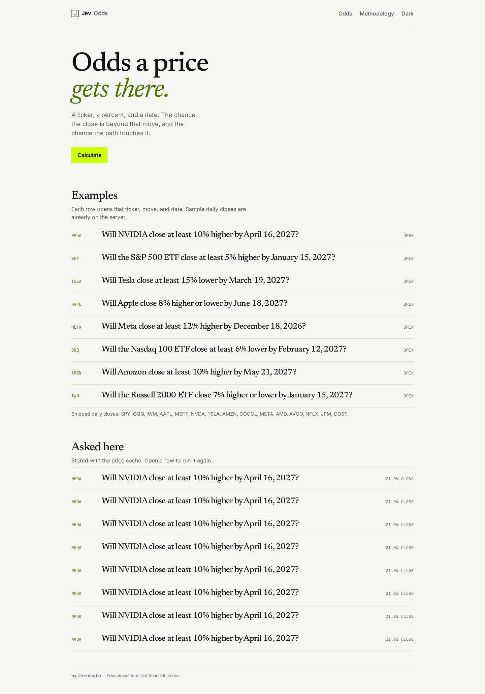
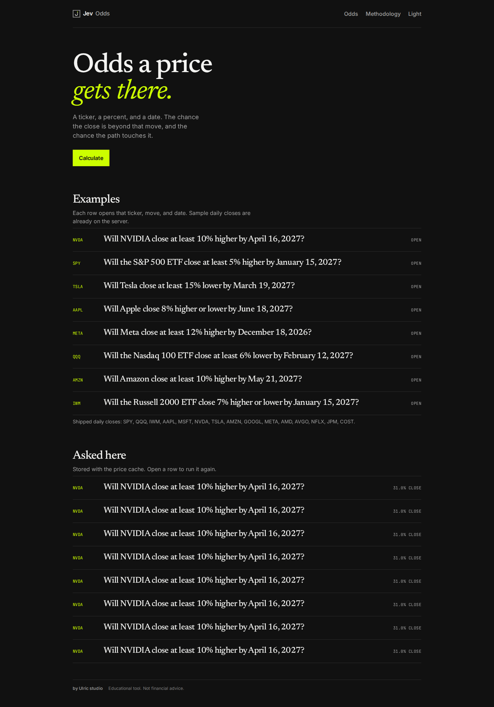
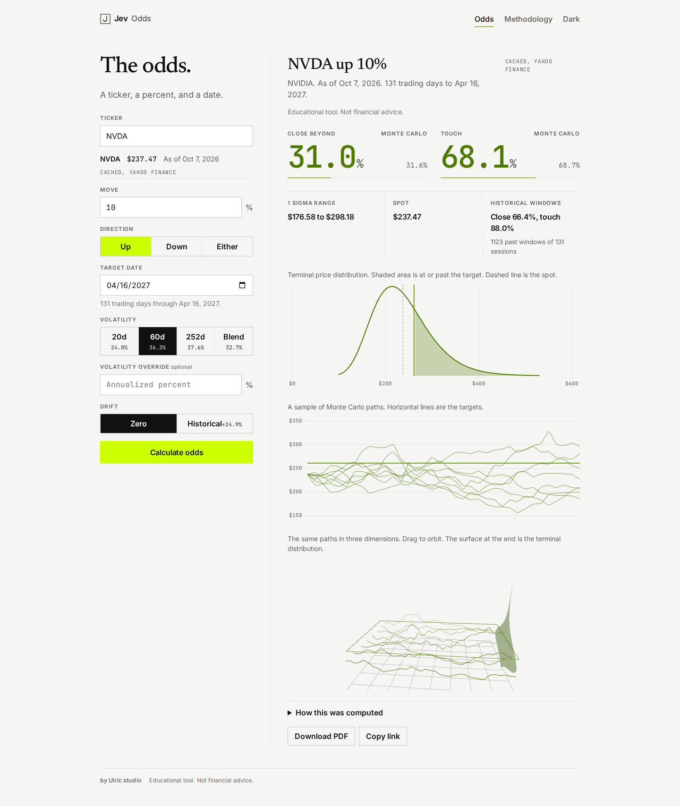
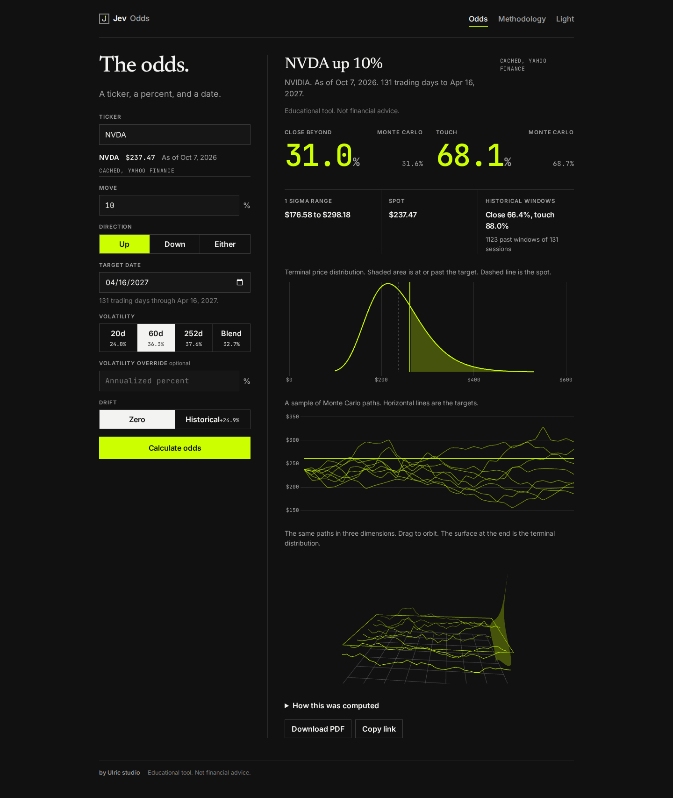
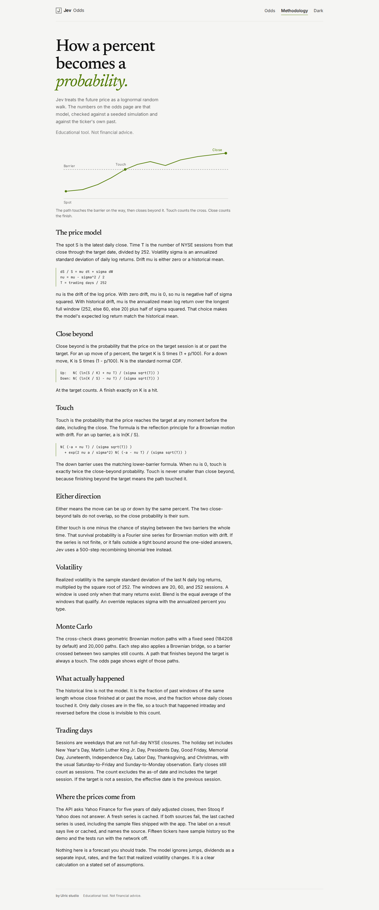
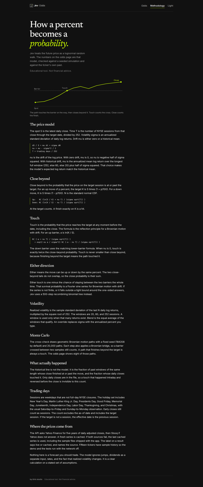
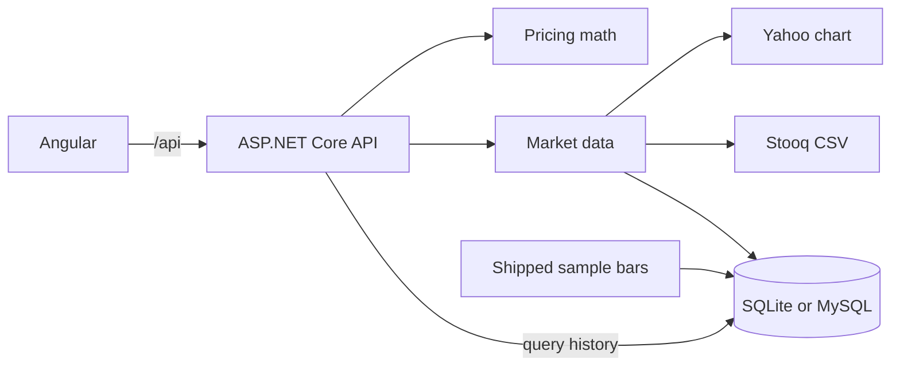

# Jev Odds

Ask the odds that a ticker moves by a percent before a date.

Educational tool. Not financial advice.



## What it does

You pick a ticker, a percent move, a direction (up, down, or either), and a target date. Jev returns the probability of closing at or past that move on the date, and the probability of touching it at any point before then.

The page address stores the query, so a result can be shared by copying the link. A landing page lists real example questions. A methodology page writes down the formulas.

## Screenshot tour

Landing, light and dark, desktop width:




Odds readout, light and dark:




Methodology, light and dark:




Phone width is in the same folder: `home-light-phone.png`, `home-dark-phone.png`, `result-light-phone.png`, `result-dark-phone.png`, `method-light-phone.png`, `method-dark-phone.png`.

## Features

- Landing questions that open a real ticker, move, and date
- Ticker autocomplete from a built-in list, plus free entry for other symbols
- Percent move, direction, target date, and trading-day count
- Realized volatility over 20, 60, or 252 sessions, or an equal-weight blend, with an optional override
- Drift of zero, or the historical mean log return
- Analytic close-beyond and touch probabilities under a lognormal model
- A seeded Monte Carlo cross-check (20,000 paths by default) shown beside the analytic numbers
- Empirical frequency of the same move over the history on hand
- 1 sigma expected range
- Terminal distribution chart and a sample of Monte Carlo paths
- A "How this was computed" panel with the formulas and inputs
- PDF download of the readout
- Query history stored next to the price cache
- Live Yahoo Finance data, with Stooq as a fallback, and a server-side cache
- Shipped sample history for 15 tickers so the app still runs offline
- A label that says whether the result used live or cached data
- Light and dark mode. The choice is remembered. With no saved choice, the app follows the system theme.
- Phone and desktop layouts
- Motion on entrances, numbers, charts, and a three-dimensional path field. `prefers-reduced-motion` turns it off. See Motion below.

## Motion

Pages and sections fade in and rise about 12 pixels, over roughly a third of a second, with a short stagger between children. Moving from one page to another crossfades. Buttons, the direction control, and the theme control ease with a small spring. Changing theme fades the colors instead of cutting them.

The close and touch numbers count up. Their rules fill from zero once the readout is in view. The distribution line draws across, then the shaded area fills. The sample paths draw left to right.

The methodology page draws one path: the spot, the barrier, the touch, and the close.

Under a result, the same paths sit in a lime field you can drag to orbit. A lit surface at the far end is the terminal distribution. three.js loads only for that view. The pixel ratio is capped at 2, and the scene pauses when it is off screen or the tab is hidden. If WebGL is unavailable, or the system asks for reduced motion, a still drawing of the same paths is shown instead. Reduced motion also makes the other animation instant, with no count-up and no autoplay.

## Stack

- ASP.NET Core 8 Web API
- Angular 22, standalone components and signals
- EF Core with SQLite by default, or MySQL through Pomelo when you select it
- Chart.js for the distribution and path charts
- three.js for the orbitable path field, loaded only when a result is on screen
- QuestPDF (Community license) for the one-page PDF
- xUnit for the math, the trading calendar, the sample files, and the SQLite migration

Market data uses free no-key endpoints only. Nothing in this repo calls a paid API.

## Architecture



The browser is a static build served by the API in Docker. In development, `ng serve` proxies `/api` to the API on port 5080.

Prices are daily adjusted closes. The API tries Yahoo, then Stooq, and writes a fresh series into the database. If both fail, it serves the last cached series. Sample files are seeded on startup when that ticker has no bars yet. Seed rows are labeled cached sample. A live row newer than `Odds__CacheHours` is labeled cached. A fetch that just succeeded is labeled live.

## Math

Spot S is the latest close. T is trading days divided by 252. sigma is annualized realized volatility. mu is 0, or the historical mean log return plus half of sigma squared. nu is mu minus half of sigma squared. N is the standard normal CDF. K is the target price.

Close beyond, up:

```
N( (ln(S / K) + nu T) / (sigma sqrt(T)) )
```

Close beyond, down:

```
N( (ln(K / S) - nu T) / (sigma sqrt(T)) )
```

Touch, up, with a = ln(K / S):

```
N( (-a + nu T) / (sigma sqrt(T)) ) + exp(2 nu a / sigma^2) N( (-a - nu T) / (sigma sqrt(T)) )
```

The down barrier uses the matching lower-barrier formula. Either close is the sum of the two tails. Either touch is one minus the probability of staying between the barriers, from a Fourier sine series, with a binomial tree if that series is not usable.

Monte Carlo uses geometric Brownian motion, a fixed seed, and a Brownian bridge so a barrier crossed between samples still counts. The empirical line is the fraction of past windows of the same length in the daily closes.

The methodology page in the app says the same thing in prose.

## API

| Method | Path | Purpose |
| --- | --- | --- |
| GET | `/api/health` | Liveness |
| GET | `/api/tickers?q=` | Autocomplete |
| GET | `/api/calendar?from=&to=` | Trading-day count |
| GET | `/api/market/{ticker}` | Last close, vols, cache origin |
| POST | `/api/odds` | Full probability readout |
| GET | `/api/odds/pdf` | One-page PDF of the same query |
| GET | `/api/history?limit=` | Recent stored queries |

`POST /api/odds` body:

```json
{
  "ticker": "NVDA",
  "percent": 10,
  "direction": "up",
  "targetDate": "2027-04-16",
  "volWindow": "60",
  "volOverridePercent": null,
  "drift": "zero"
}
```

`direction` is `up`, `down`, or `either`. `volWindow` is `20`, `60`, `252`, or `blend`. `drift` is `zero` or `historical`.

## Run with Docker

From the repository root, zero configuration uses SQLite inside a volume:

```
docker compose up --build
```

Open http://localhost:8080.

The SQLite file is `/data/jev-odds.db` on the `odds-data` volume. The first request for a ticker tries Yahoo Finance, then Stooq. If both fail, the API serves the shipped sample for the fifteen demo tickers, or the last series it saved.

### MySQL in Docker

The MySQL service is behind the `mysql` profile so the default command stays a single container. Copy `.env.example` to `.env`, uncomment the Docker Compose MySQL block, and run:

```
docker compose --profile mysql --env-file .env up --build
```

The example account in that file is `jev` / `jev` on database `jev_odds`. The API then uses `Database__Provider=MySql` and a connection string whose host is the `mysql` service. Migrations run on startup, then the sample bars are seeded.

## Run the API and the UI separately

API, SQLite, no extra setup:

```
cd src/JevOdds.Api
dotnet run
```

The API listens on http://localhost:5080.

UI, in another terminal:

```
cd client
npm install
npm start
```

The dev server listens on http://localhost:4200 and proxies `/api` to the API. The UI calls `api/...` and resolves that against the page `<base href>`, so the same build works at the site root and under a sub-path.

## Environment variables

| Variable | Default | Role |
| --- | --- | --- |
| `Database__Provider` | `Sqlite` | `Sqlite` or `MySql` |
| `Database__ServerVersion` | empty, which means auto-detect | MySQL only. Example: `5.7.39-mysql`. If detection cannot connect, the API assumes 5.7.39. |
| `ConnectionStrings__Odds` | `Data Source=data/jev-odds.db` | SQLite path or MySQL connection string. MySQL strings should include `CharSet=utf8mb4`. The API adds that charset when it is missing. |
| `DATABASE_PROVIDER` | `Sqlite` | Compose alias mapped onto `Database__Provider` |
| `ODDS_CONNECTION` | `Data Source=/data/jev-odds.db` | Compose alias mapped onto `ConnectionStrings__Odds` |
| `Odds__CacheHours` | `12` | How long a live fetch counts as fresh |
| `Odds__YahooBaseUrl` | Yahoo chart host | No key |
| `Odds__StooqBaseUrl` | Stooq host | No key |
| `Odds__MonteCarloPaths` | `20000` | Clamped from 1,000 to 50,000 |
| `Odds__MonteCarloSeed` | `184208` | Seed for the cross-check |
| `Odds__PublicBaseUrl` | empty | External origin and path used in links the API writes, such as the result URL in the PDF. Example: `http://localhost:8888/grokbot/asp/jev-odds` |
| `Odds__PathBase` | empty | Set this only when the reverse proxy forwards the sub-path to Kestrel. Example: `/grokbot/asp/jev-odds` |
| `ASPNETCORE_ENVIRONMENT` | `Production` in Docker | `Development` enables the Angular dev CORS policy |
| `ASPNETCORE_URLS` | `http://localhost:5080` in the launch profile | Listen address |
| `MYSQL_DATABASE` | `jev_odds` | Compose MySQL profile only |
| `MYSQL_USER` | `jev` | Compose MySQL profile only |
| `MYSQL_PASSWORD` | empty until `.env` sets it | Compose MySQL profile only |
| `MYSQL_ROOT_PASSWORD` | empty until `.env` sets it | Compose MySQL profile only |
| `MYSQL_PORT` | `3306` | Host port for the Compose MySQL profile |

Copy `.env.example` to `.env` if you want a local reminder. The API does not load `.env` by itself. `docker compose up` works with the defaults and does not need a `.env` file.

## Deploy under MAMP

This is the layout Eric runs: Apache on port 8888 serves the UI at `http://localhost:8888/grokbot/asp/jev-odds/`, and that same prefix proxies API calls to Kestrel. MAMP's MySQL is 5.7.39 on `127.0.0.1` port `8889`. The example account is `root` / `root`, and it belongs only in `appsettings.MySql.example.json` and `.env.example`.

1. Start Apache and MySQL in MAMP.
2. Create the database with a 5.7 charset. `utf8mb4_0900_ai_ci` is MySQL 8 only. Use:

```
CREATE DATABASE jev_odds CHARACTER SET utf8mb4 COLLATE utf8mb4_unicode_ci;
```

3. Copy `src/JevOdds.Api/appsettings.MySql.example.json` over `src/JevOdds.Api/appsettings.Development.json` (gitignored), or export the matching variables from `.env.example`. Leave `Database:ServerVersion` empty so startup calls `ServerVersion.AutoDetect`. Set it to `5.7.39-mysql` if you want to skip the probe. The example connection string sets `SslMode=None` because a .NET 8 process often cannot complete a TLS handshake with MySQL 5.7 on localhost. Leave `Odds:PathBase` empty when Apache strips the prefix and forwards `/api/...` to Kestrel. Set `Odds:PublicBaseUrl` to `http://localhost:8888/grokbot/asp/jev-odds` so the PDF result link points at the public site.
4. From `src/JevOdds.Api`, run `dotnet run`. It listens on http://localhost:5080, applies the MySQL migrations, and seeds any missing sample tickers. Cached bars and query history share `jev_odds`.
5. Build the UI for the sub-path:

```
cd client
npm install
npx ng build --base-href /grokbot/asp/jev-odds/
```

6. Copy `client/dist/client/browser/` into the Apache document folder so the files live at `htdocs/grokbot/asp/jev-odds/`. The build includes `.htaccess`, which sends unknown paths back to `index.html` and leaves `api/` alone.
7. Proxy the API from that prefix. In the Apache config:

```
ProxyPreserveHost On
ProxyPass /grokbot/asp/jev-odds/api http://127.0.0.1:5080/api
ProxyPassReverse /grokbot/asp/jev-odds/api http://127.0.0.1:5080/api
```

The browser then loads `http://localhost:8888/grokbot/asp/jev-odds/`, the router stays under that base, and calls such as `api/odds` and `api/odds/pdf` land on the proxy. Copy link uses the same base, so a shared URL keeps the `/grokbot/asp/jev-odds/` prefix.

If you instead proxy the whole prefix to Kestrel and let Kestrel serve `wwwroot`, set `Odds__PathBase=/grokbot/asp/jev-odds` and copy the built files into `wwwroot`. Do that only when the incoming request path still contains the prefix.

To go back to zero config, set `Database:Provider` to `Sqlite` or delete the Development settings file.

## Tests

```
dotnet test jev-odds.sln
```

The suite checks the normal CDF, volatility windows, the blend, empirical frequencies, the NYSE calendar (including 2026 holidays), agreement between the analytic probabilities and Monte Carlo within 0.02, touch at least as large as close, the fifteen sample files, a SQLite migration that stores a query, public result links, and the MySQL 5.7 version fallback.

GitHub Actions (`.github/workflows/ci.yml`) runs those tests and builds the Angular app.

## License

MIT. Copyright Eric 2026.

Educational tool. Not financial advice.
